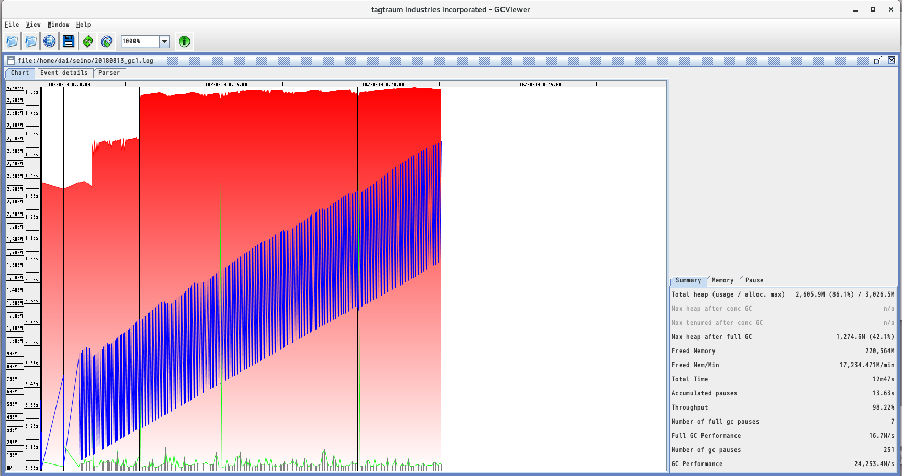

# gc_jdk8

* centos7.5
* oracle12c
* openJDK8
* tomcat8
* SpringMVC5

# javaパラメータ
```
java -Xms2048m -Xmx3072m -Djava.security.egd=file:/dev/./urandom -XX:MaxMetaspaceSize=256M -verbose:gc -Xloggc:gc.log -XX:+PrintGCDateStamps -XX:+PrintGCDetails
```

# MaxMetaspaceSize指定無し
  

# MaxMetaspaceSize指定有り
  
